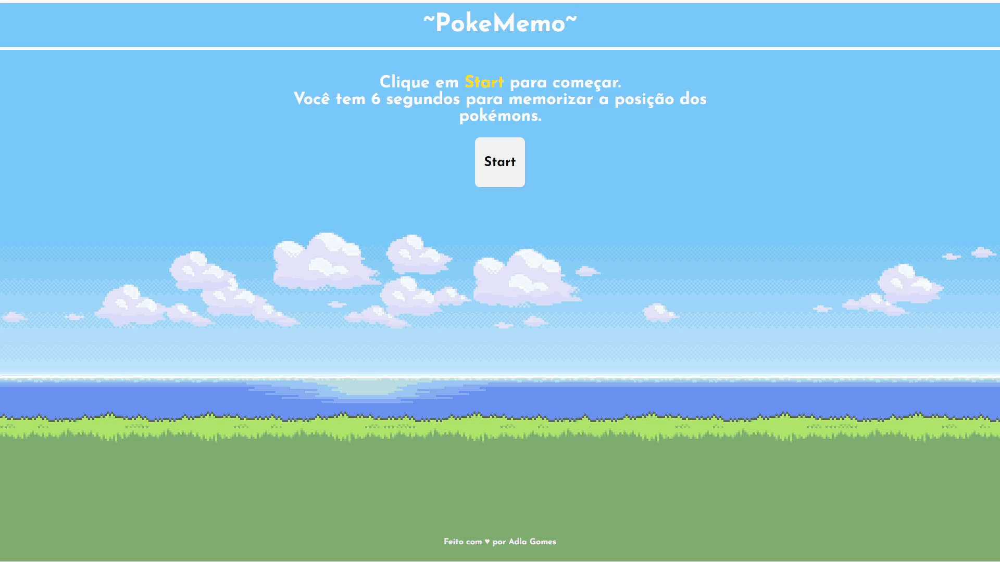

## ~ :gear: Tecnologias 
  - Vite
  - React
  - CSS
  - PokeAPI

## ~ :clipboard: Projeto 
  PokeMemo é um jogo da memória diferente desenvolvido por mim com o único intuito de por em prática os conhecimentos adquiridos estudando react e consumo de API.
  
  ### Como funciona:
O jogador deverá clicar no botão ***START*** para que nove cartões diferentes sejam exibidos na tela, todos exibirão a imagem e o nome do respectivo pokemon. Após um tempo de 6s, os cartões irão mudar a face e uma pergunta aparecerá para o jogador . Ao clicar no cartão escolhido a rodada será encerrada exibindo uma mensagem informando o sucesso ou o fracasso obtido e um ponto será acumulado na tabela de score. Um botão de ***RESTART*** surgirá junto com a mensagem informativa e ao clicar nele uma nova rodada começará.

## ~ 🕹️ Como jogar?
Acesse esse [link](https://pokememo-pink.vercel.app/)
